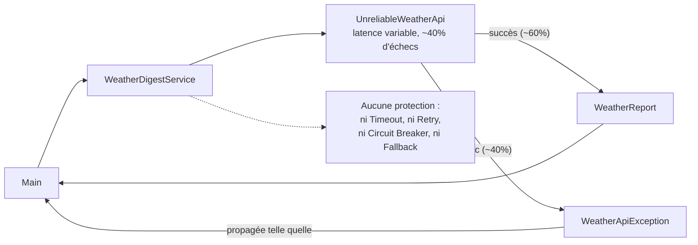

## 1. Constat : un client qui ne pardonne rien

### Pour commencer
- Ouvrez `WeatherDigestService` : il ne fait qu'une chose, appeler `WeatherApi.fetch(city)` et renvoyer le résultat tel quel.
- Ouvrez `UnreliableWeatherApi` : elle simule une vraie API météo externe, avec une latence variable (50 à 200ms) et environ **40% d'échecs**.
- Lancez `Main` plusieurs fois (depuis votre IDE) : il appelle `getTodayForecast("Dijon")` 10 fois de suite et affiche le résultat de chaque appel.

### Ce qui est en place aujourd'hui

Un seul chemin, direct, sans aucune couche de protection entre `WeatherDigestService` et la dépendance externe : c'est exactement ce que vous allez faire évoluer étape par étape.

### Ce que vous devriez observer
- Une proportion notable des appels échoue purement et simplement (`WeatherApiException` non gérée).
- Rien ne retente un appel qui a échoué : un simple "blip" réseau fait échouer toute l'opération, alors qu'un deuxième essai aurait peut-être suffi.
- Rien ne protège l'appelant d'un appel lent : si l'API met du temps à répondre, `getTodayForecast` attend tout aussi longtemps.
- Si l'API tombait en panne totale, chaque appel continuerait à la solliciter individuellement, sans jamais "laisser une chance" au service de récupérer.

### Le test existant
`WeatherDigestServiceTest.propagates_the_failure_immediately_without_retrying` documente ce comportement actuel : il **passe** avec le code de départ, et prouve qu'un seul appel est fait avant d'abandonner. Vous allez le faire évoluer (ou le compléter) au fil des étapes.

### Objectif de cette étape
En pair/mob, listez à l'oral les problèmes concrets que ce manque de protection pourrait causer en production (au-delà de l'inconfort pour un utilisateur) : effet domino sur un service appelant, ressources bloquées, aggravation d'une panne déjà en cours...

Pas de code à cette étape : c'est un diagnostic, la base des étapes suivantes.

**Suite : [2. Timeout](02.timeout.md)**
