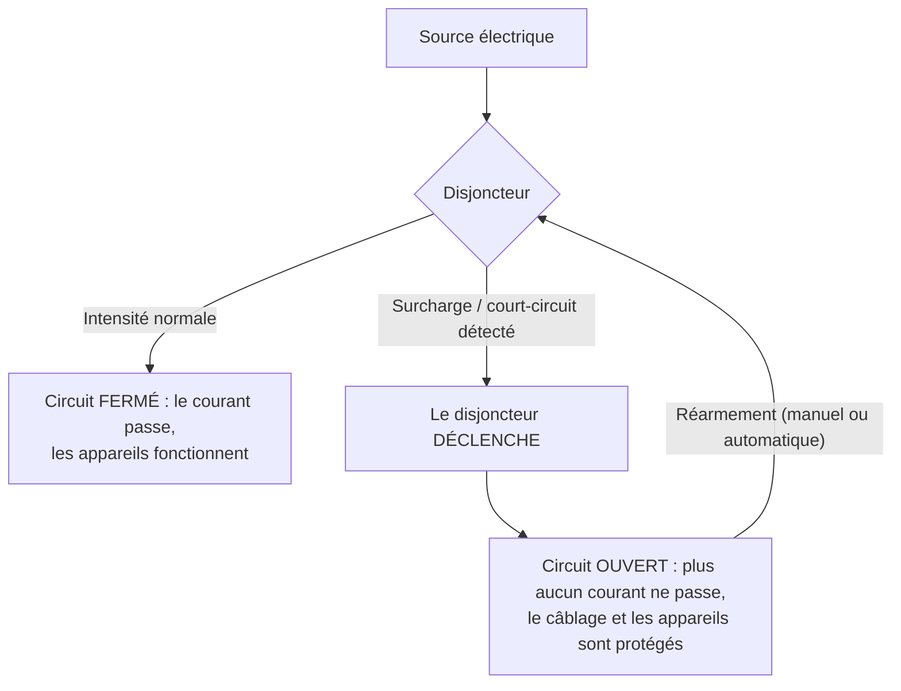
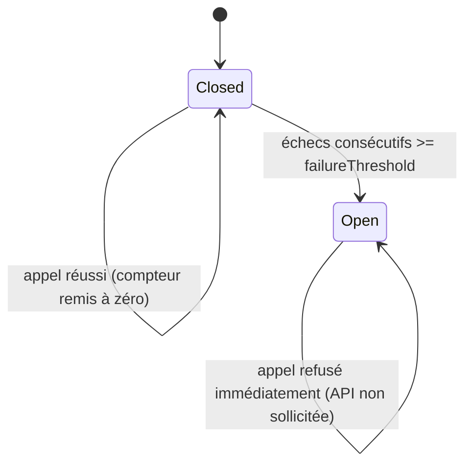

## 5. Circuit Breaker — Closed / Open : arrêter de s'acharner

### Le problème que le retry ne résout pas
Le retry (même avec backoff) suppose que l'échec est passager. Mais si l'API météo est **vraiment en panne** pendant 10 minutes, chaque appelant va quand même patienter sur son backoff puis échouer, encore et encore, pendant toute la durée de la panne — en continuant à solliciter un service déjà à terre. C'est le rôle du **Circuit Breaker** : détecter qu'une dépendance est durablement en échec, et arrêter de l'appeler pendant un moment, pour échouer instantanément côté appelant (et laisser le service en face respirer).

### Le principe, dans l'industrie
Le nom "Circuit Breaker" vient tout droit de l'électricité. Un disjoncteur protège une installation : tant que le courant reste dans des valeurs normales, il laisse passer ; dès qu'il détecte une surcharge ou un court-circuit, il **déclenche** et coupe le circuit, protégeant le câblage et les appareils en aval — plutôt que de les laisser griller.

### Le même principe, dans le monde des architectures distribuées
Michael Nygard a repris cette métaphore dans son livre *Release It!* pour l'appliquer aux appels réseau entre services : plutôt que de laisser un service appelant continuer à taper sur une dépendance en panne (et risquer de propager la panne, comme un court-circuit qui se propagerait de proche en proche dans un système électrique), on "coupe le circuit" — on arrête d'appeler la dépendance pendant un moment, et on échoue immédiatement côté appelant.

### La machine à états (partielle pour cette étape)

- **Closed** (état normal) : les appels passent normalement vers l'API enveloppée. Chaque échec incrémente un compteur d'échecs consécutifs ; chaque succès le remet à zéro. Si le compteur atteint un seuil (`failureThreshold`), le circuit passe à **Open**.
- **Open** : plus aucun appel n'est transmis à l'API enveloppée. Chaque appel échoue immédiatement (par exemple avec une `CircuitOpenException`), sans latence, sans solliciter la dépendance en difficulté.

### L'exercice
1. Créez `CircuitBreakerWeatherApi implements WeatherApi`, avec un état interne (`CLOSED` ou `OPEN` pour l'instant — `HALF_OPEN` viendra à l'étape 6) et un `failureThreshold` configurable.
2. Écrivez des tests avec un double de test qui échoue systématiquement : vérifiez qu'après `failureThreshold` échecs, les appels suivants échouent **sans même appeler** l'API enveloppée (vous pouvez le prouver en comptant les appels reçus par votre double de test, comme dans les étapes précédentes).
3. Vérifiez aussi qu'un succès, tant que le circuit est encore Closed, remet bien le compteur d'échecs consécutifs à zéro (des échecs intermittents ne doivent pas ouvrir le circuit s'ils sont entrecoupés de succès).

### Critère de sortie
`CircuitBreakerWeatherApi` a ses propres tests pour les transitions Closed → Closed (échec isolé) et Closed → Open (échecs consécutifs atteignant le seuil), avec vérification que l'API enveloppée n'est plus sollicitée une fois le circuit Open.

**Suite : [6. Circuit Breaker — Half-Open](06.circuit-breaker-half-open.md)**
