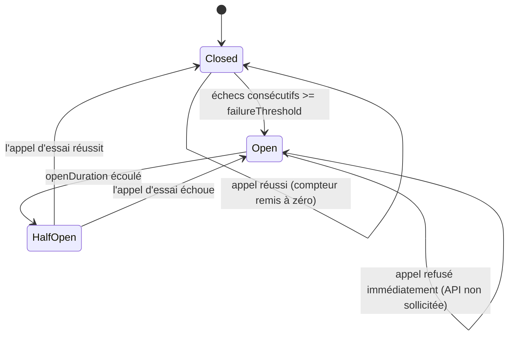
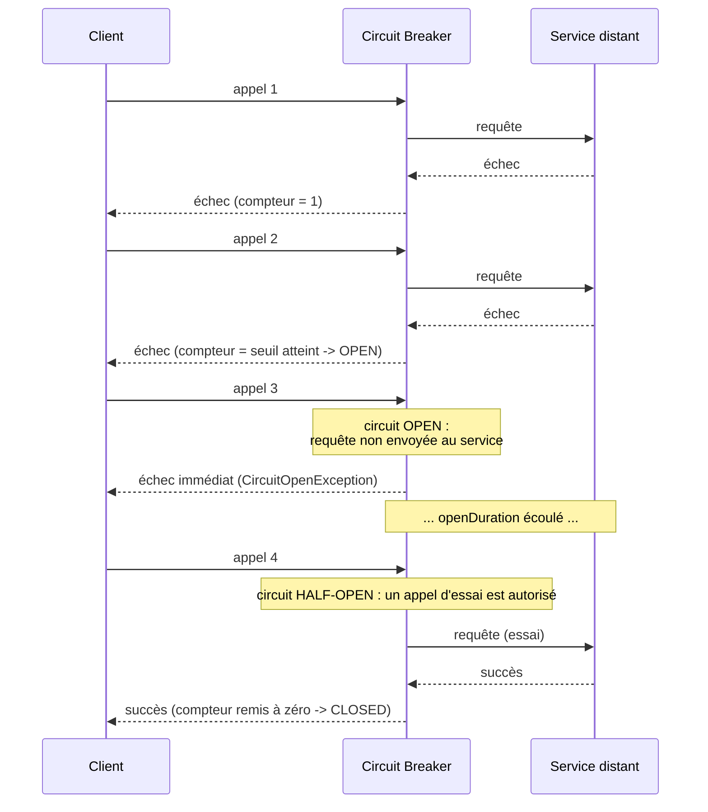

## 6. Circuit Breaker — Half-Open : tester prudemment le retour

### Le problème d'un circuit qui reste Open pour toujours
Un circuit qui, une fois Open, ne se rouvre jamais n'est pas très utile : la dépendance a peut-être récupéré depuis longtemps, mais plus personne ne le saura jamais puisque plus personne ne l'appelle. Il faut un mécanisme pour **retester prudemment** si la dépendance va mieux.

### La machine à états complète

- **Half-Open** : après un délai `openDuration` passé en Open, le prochain appel est autorisé à passer réellement vers l'API enveloppée, à titre d'essai. S'il réussit, le circuit repasse à Closed (la dépendance semble rétablie). S'il échoue, le circuit repasse à Open (on redémarre le compte à rebours).

### Ce que ça donne côté appelant, dans une architecture distribuée

Remarquez l'appel 3 : la requête n'atteint jamais `S`. C'est exactement le bénéfice recherché dans une architecture distribuée — épargner un service déjà en difficulté, et répondre à l'appelant sans le laisser attendre une latence réseau inutile.

### L'exercice
1. Injectez un `Clock` dans `CircuitBreakerWeatherApi` (l'interface `Clock`/`now()` déjà fournie dans le code de départ, sur le même principe que dans le kata Pizzeria).
2. Quand le circuit passe à Open, mémorisez l'instant (`openedAt = clock.now()`).
3. Quand un appel arrive alors que le circuit est Open, vérifiez si `clock.now()` a dépassé `openedAt + openDuration`. Si oui, passez en Half-Open et laissez cet appel passer réellement vers l'API enveloppée.
4. Pour tester ces transitions **sans attendre réellement** `openDuration`, utilisez un `Clock` de test que vous contrôlez manuellement (une fausse horloge que vous pouvez avancer artificiellement dans vos tests, par exemple `testClock.advanceBy(Duration.ofSeconds(30))`).

### Ce qu'il faut prouver par des tests
- Tant que `openDuration` n'est pas écoulé, un appel en Open échoue toujours immédiatement sans solliciter l'API enveloppée.
- Une fois `openDuration` écoulé, l'appel suivant sollicite bien l'API enveloppée (Half-Open).
- Si cet appel d'essai réussit, le circuit repasse Closed (et un nouveau cycle d'échecs consécutifs peut recommencer normalement).
- Si cet appel d'essai échoue, le circuit repasse Open (avec un nouveau `openedAt`).

### Critère de sortie
Votre `CircuitBreakerWeatherApi` gère les 3 états, entièrement testé de façon déterministe (aucun `Thread.sleep` réel dans les tests grâce au `Clock` injecté).

**Suite : [7. Fallback / Failover](07.fallback-failover.md)**
