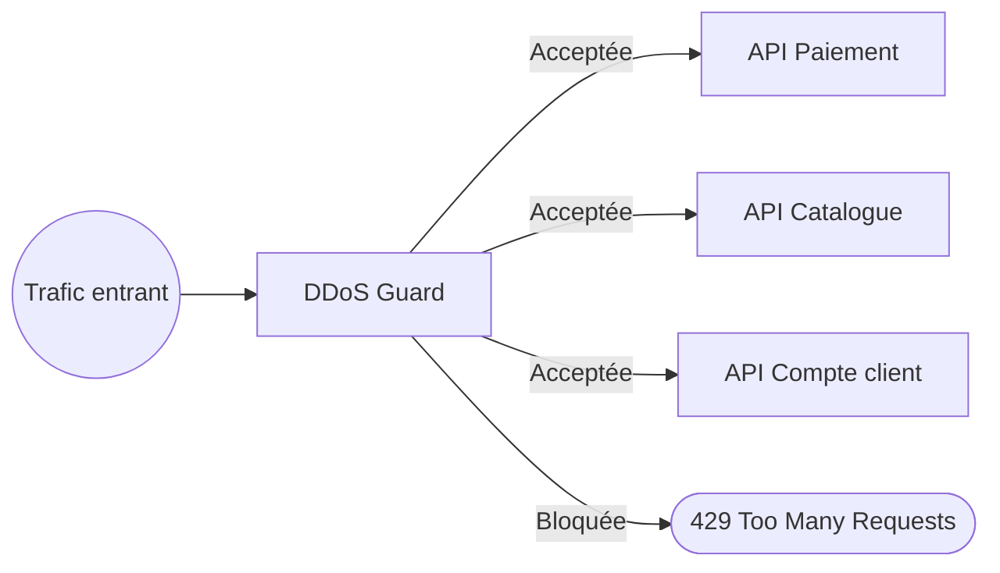
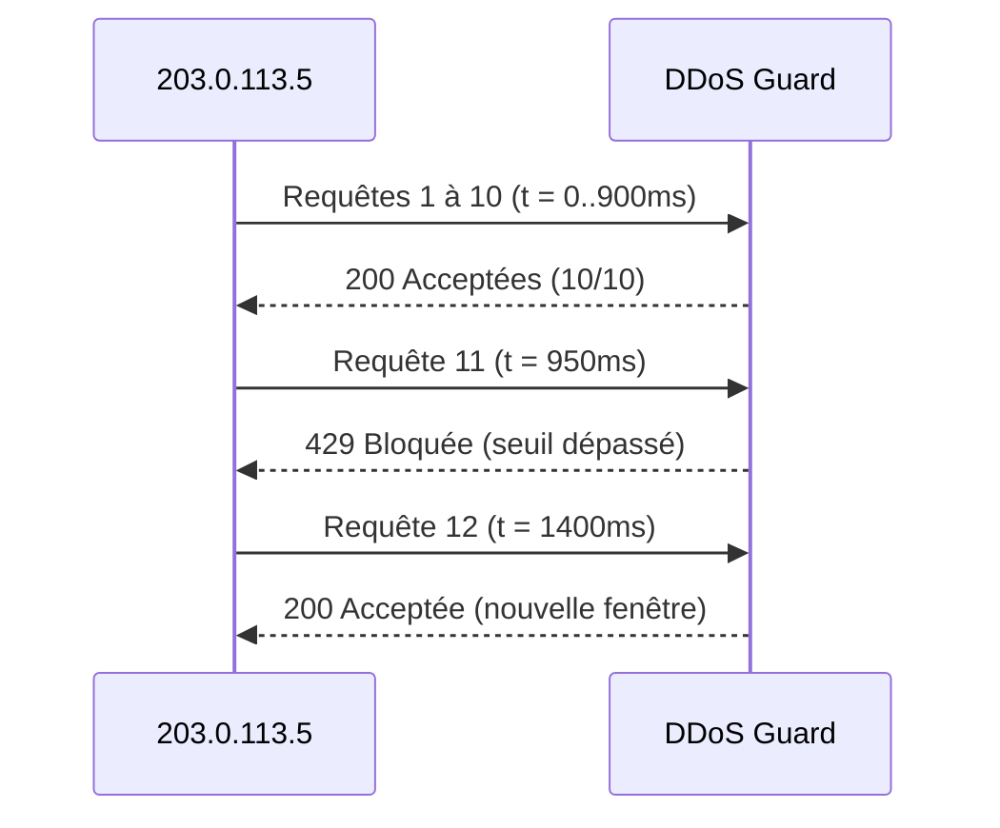
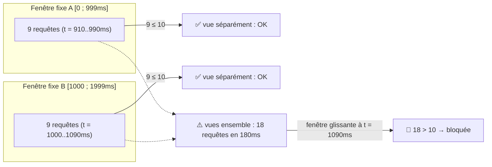
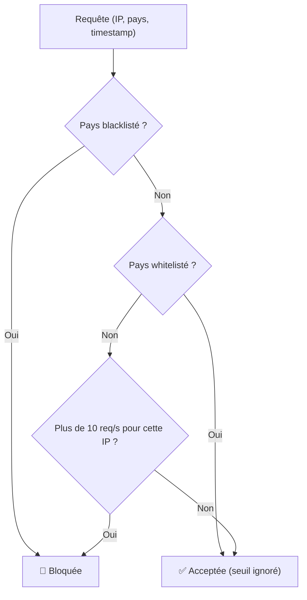
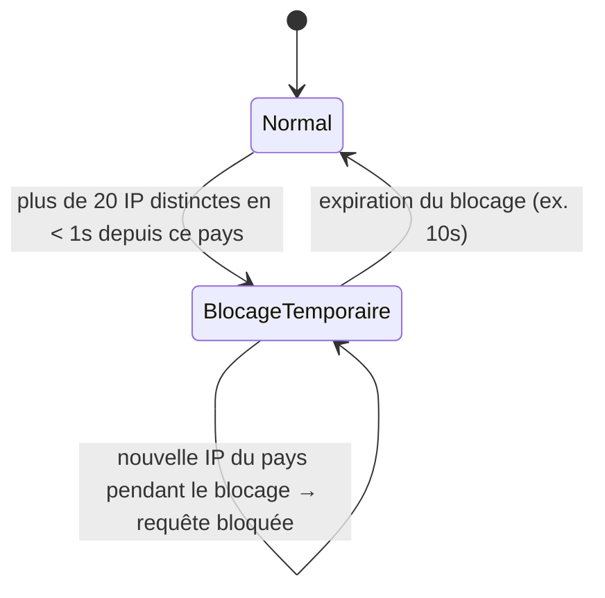

## DDoS Guard

### **Contexte**
Vous développez un module de protection placé devant l'ensemble des services exposés publiquement par votre entreprise — pas une seule API, mais toute une flotte de services (paiement, catalogue, compte client...) qui partagent la même porte d'entrée. Ce module reçoit en continu des informations sur les requêtes entrantes (IP, timestamp, pays) et doit décider, pour chacune, si elle doit être **acceptée** ou **bloquée**, avant même qu'elle n'atteigne le service visé.



Un seul point de décision protège donc plusieurs services d'un coup : une IP ou un pays sanctionné par le Guard n'atteint aucun d'entre eux, ce qui est justement l'intérêt d'un tel module par rapport à une protection dupliquée service par service.

L'équipe sécurité vous donne un cahier des charges qui va s'enrichir au fil de l'eau, comme c'est souvent le cas en entreprise : chaque étape ajoute une règle de décision, sans jamais casser celles déjà livrées. C'est aussi un bon terrain pour pratiquer le développement piloté par les tests sur du code **stateful** (le module se souvient de ce qui s'est passé dans le passé récent), contrairement à des katas purs comme Prime Numbers.

### **Ce qui arrive concrètement sur le Guard**
Peu importe le service visé, une requête HTTP arrive en amont sur la même porte d'entrée :

```http
GET /api/paiement/charge HTTP/1.1
Host: api.coda-shop.com
X-Forwarded-For: 203.0.113.5
X-Country-Code: FR
```

Le Guard ne parle pas HTTP : il reçoit un **événement déjà extrait** de la requête (IP relevée sur la connexion/le header `X-Forwarded-For`, pays déjà résolu par un service de géolocalisation en amont, timestamp posé par une horloge injectée). C'est cet événement, pas la requête HTTP brute, qui sert de donnée d'entrée à toutes les règles des étapes 1 à 4 :

```json
{
  "ip": "203.0.113.5",
  "country": "FR",
  "timestamp": 1735689600000
}
```

Le champ `service` (`paiement`, `catalogue`, `compte`...) visible dans l'URL n'apparaît volontairement pas dans cet événement : la protection est **globale**, elle ne dépend pas de la destination de la requête.

**Un petit flux d'événements tel qu'il arrive sur le Guard, dans l'ordre :**

```json
[
  { "ip": "203.0.113.5", "country": "FR", "timestamp": 1735689600000 },
  { "ip": "203.0.113.5", "country": "FR", "timestamp": 1735689600120 },
  { "ip": "198.51.100.9", "country": "DE", "timestamp": 1735689600180 },
  { "ip": "203.0.113.5", "country": "FR", "timestamp": 1735689600310 }
]
```

C'est cette suite d'événements que vos tests vont construire et rejouer contre le Guard, en injectant les timestamps plutôt qu'en les laissant venir d'une horloge réelle.

### **Contraintes générales**
- Aucune dépendance à une horloge système réelle dans les tests : le temps doit être **injecté** (pas de `Thread.sleep`, pas de `new Date()` en dur dans la logique métier).
- Petits commits, un refactoring visible entre chaque étape.
- Bonus : appliquer autant que possible les règles d'**Object Calisthenics** (pas de `else`, pas de getters bruts, des objets plutôt que des primitives pour les concepts métier — une `IpAddress`, une `RequestWindow`... plutôt que des `String` et des `long` qui se baladent partout).

---

### **Étape 1 — Seuil simple par IP**
Une requête est caractérisée par une **adresse IP** et un **timestamp**.

**Règle :** si une même IP envoie plus de **10 requêtes en 1 seconde**, toute requête supplémentaire dans cette fenêtre est bloquée.

**Exemple — IP `203.0.113.5`, seuil = 10 requêtes / 1000 ms :**

| Requête | t (ms) | Compteur | Résultat | Explication                          |
|---------|--------|----------|----------|---------------------------------------|
| 1       | 0      | 1/10     | Acceptée | Première requête de la fenêtre.       |
| ...     | ...    | ...      | Acceptée | Débit régulier, sous le seuil.        |
| 10      | 900    | 10/10    | Acceptée | Dernière requête tolérée.             |
| 11      | 950    | 11/10    | **Bloquée**  | Seuil dépassé, toujours dans la fenêtre. |
| 12      | 1400   | 1/10     | Acceptée | Nouvelle fenêtre, le compteur repart à zéro. |



Cas de test à couvrir :
- 1 requête isolée → acceptée.
- 10 requêtes en 1 seconde depuis la même IP → toutes acceptées.
- 11e requête dans la même fenêtre → bloquée.
- Après expiration de la fenêtre, le compteur repart à zéro.
- Deux IP différentes ne se gênent pas entre elles.

---

### **Étape 2 — Fenêtre glissante**
Remplacez la fenêtre fixe de l'étape 1 par une **fenêtre glissante** (sliding window) : à tout instant `t`, on ne compte que les requêtes reçues entre `t - 1000ms` et `t`, et non plus depuis un "reset" arbitraire toutes les secondes.

**Le problème d'une fenêtre fixe mal alignée :** une IP peut envoyer 9 requêtes juste avant la fin d'une fenêtre, puis 9 autres juste après le début de la suivante. Chaque fenêtre prise isolément reste sous le seuil de 10... alors que 18 requêtes viennent d'être envoyées en à peine 100 ms.

| Requête | t (ms) | Fenêtre fixe concernée      | Vu par la fenêtre fixe | Vu par la fenêtre glissante |
|---------|--------|------------------------------|--------------------------|-------------------------------|
| 1 à 9   | 910–990   | Fenêtre A `[0 ; 999]`      | 9/10 → acceptées         | comptées dans la fenêtre `[t-1000 ; t]` |
| 10 à 18 | 1000–1090 | Fenêtre B `[1000 ; 1999]`  | 9/10 → acceptées         | comptées dans la fenêtre `[t-1000 ; t]` |
| 18      | 1090   | Fenêtre B                    | **9/10 → acceptée** (angle mort !) | 18 requêtes en 180ms → **bloquée** |



Cas de test à ajouter :
- Requêtes espacées régulièrement qui ne dépassent jamais le seuil dans une fenêtre glissante, alors qu'elles l'auraient dépassé avec une fenêtre fixe mal alignée.
- Une rafale à cheval sur deux fenêtres fixes doit être détectée par la version glissante.

---

### **Étape 3 — Dimension géographique**
Chaque requête porte désormais aussi un **code pays** (déjà résolu en amont, ex : `"FR"`, `"RU"`, `"CN"`...).

**Règles à ajouter :**
- Une liste de pays **blacklistés** : toute requête en provenance de ces pays est bloquée, quel que soit le débit.
- Une liste de pays **whitelistés** : ces pays ne sont jamais bloqués par la règle de seuil (étape 1/2), seulement par la blacklist si applicable.
- Les pays ni blacklistés ni whitelistés suivent la règle de seuil standard.


*Ce diagramme fait un choix — blacklist prioritaire sur whitelist — pour le cas où un pays serait dans les deux listes. C'est un exemple, pas une obligation : à vous de trancher et de le prouver par un test explicite.*

**Exemples de requêtes :**

| IP              | Pays  | Débit                    | Résultat | Explication                                   |
|-----------------|-------|---------------------------|----------|-------------------------------------------------|
| `198.51.100.1`  | `RU` (blacklisté) | 1 requête isolée         | **Bloquée**  | Pays blacklisté, le débit n'entre même pas en jeu. |
| `198.51.100.2`  | `FR` (whitelisté) | 50 requêtes en 1 seconde | Acceptée | Pays whitelisté, exempté du seuil.               |
| `198.51.100.3`  | `DE` (neutre)     | 11 requêtes en 1 seconde | Bloquée (11e) | Aucune liste ne s'applique, règle de seuil standard. |

Cas de test à ajouter :
- Requête depuis un pays blacklisté → bloquée même en dessous du seuil.
- Requête depuis un pays whitelisté qui dépasse largement le seuil → acceptée.
- Un pays peut-il être dans les deux listes ? Décidez d'un comportement et testez-le explicitement.

---

### **Étape 4 — Détection d'attaque distribuée**
Un DDoS réel n'utilise pas une seule IP : des centaines d'IP différentes attaquent simultanément, souvent depuis la même zone géographique.

**Règle :** si plus de **20 IP distinctes** émettent des requêtes depuis le **même pays** en moins de **1 seconde**, déclencher un blocage temporaire de tout le pays pendant une durée définie (ex : 10 secondes), même pour des IP qui n'avaient rien fait de mal individuellement.



**Exemple — pays `"CN"`, seuil = 20 IP distinctes / 1000 ms, blocage = 10 000 ms :**

| Événement                                   | t (ms)  | Résultat                                    |
|----------------------------------------------|---------|-----------------------------------------------|
| IP #1 à #20 (toutes distinctes, pays `CN`)   | 0–800   | Acceptées individuellement (sous le seuil de l'étape 1) |
| IP #21 (nouvelle, pays `CN`)                 | 850     | 21e IP distincte en moins d'1s → **le pays bascule en blocage temporaire** |
| IP #22 (nouvelle, pays `CN`)                 | 900     | **Bloquée** — pays en blocage, même si cette IP n'a rien fait individuellement |
| IP #5 (déjà vue, pays `CN`)                  | 5 000   | **Bloquée** — toujours dans la fenêtre de blocage (10s) |
| IP #23 (nouvelle, pays `CN`)                 | 11 200  | Acceptée — le blocage a expiré, le pays est redevenu normal |

Cas de test à ajouter :
- 20 IP différentes, même pays, même seconde → le pays passe en blocage temporaire.
- Une 21e IP, nouvelle, dans ce pays pendant le blocage → bloquée.
- Après expiration du blocage temporaire, le pays redevient normal.
- Un pays whitelisté est-il concerné par cette règle ? À trancher et documenter dans le test.

---

### **Refactoring — pistes de discussion en fin de séance**
- Où vit la notion de "fenêtre temporelle" ? Un seul concept réutilisé aux étapes 1, 2 et 4, ou une classe par règle ?
- Comment éviter l'explosion de `if` à mesure que les règles s'accumulent (Chain of Responsibility ? Strategy ?)
- Le stockage naïf (liste de timestamps par IP) devient-il un problème de performance à l'étape 4 ? Quelle structure de données amortirait mieux le coût (buckets, compteurs par seconde) ?
- Comment testez-vous une règle qui dépend du temps sans ralentir la suite de tests avec de vrais `sleep()` ?

### **Objectifs pédagogiques**
- Concevoir un point de décision partagé qui protège plusieurs services d'un coup, plutôt qu'une protection dupliquée service par service.
- Développer du code **stateful** (le module se souvient des requêtes passées), contrairement aux katas purs comme Prime Numbers.
- Gérer le temps comme une dépendance **injectable**, jamais lue directement depuis l'horloge système.
- Faire monter la complexité progressivement, sans réécriture complète à chaque étape.
- Composer plusieurs règles de décision (seuil, listes, détection distribuée) sans faire exploser la complexité cyclomatique.
- Relier une pratique de craft (tests, Object Calisthenics) à un sujet sécurité concret et motivant.
